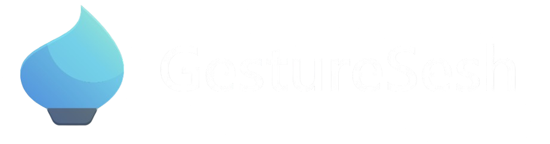
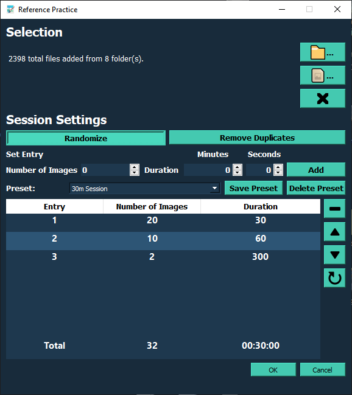
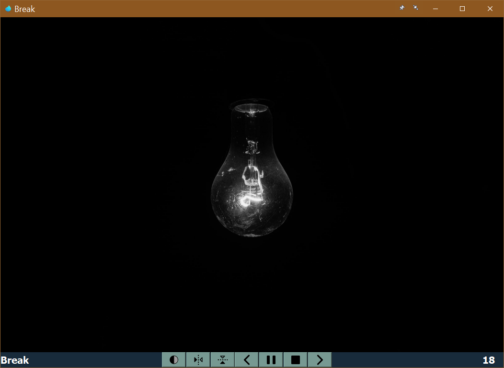

<p align="center">
  
</p>

<p align="center">
  <a href="https://github.com/adnv3k/GestureSesh/stargazers">
    
  </a>
  &nbsp;
  
  &nbsp;
  
  &nbsp;
  <a href="https://github.com/adnv3k/GestureSesh/releases">
    
  </a>
  &nbsp;<br>
  <a href="https://www.python.org/downloads/">
    
  </a>
  &nbsp;
  
  &nbsp;
  
</p>

--- 


GestureSesh supercharges gesture practice using your own reference folders. The app cycles through images on a schedule you define while keeping each at its original aspect ratio. The clutter-free interface helps you stay focused on drawing.


<h2 align="center">Your Libraries</h2> 
<div align="center">
  
</div>

<h2 align="center"> Your Sessions</h2>
<div align="center">
  
</div>

## Features

- **Cross-platform** PyQt5 interface with a unified dark theme.
- **Recursive folder scanning** with duplicate cleanup.
- **Custom schedule builder**: timed entries, breaks (0-image rows), randomization, and preset saving.
- **Auto-reload** of your last session (images, schedule, randomization).
- **Window options** (grayscale, flip, always-on-top, frameless) via hotkeys.  
  <div align="center">
    
  </div>
- **Intuitive timer**: click to pause, drag to move (auto-pause), resume where you left off.
- **Review mode**: 15 s auto-close with arrow navigation; double-click or Ctrl + O to open image folder.
- **Break indicator**: set an entry with 0 images for a timed break (💡 light appears).  
  <div align="center">
    
  </div>
- **Sound cues** for new entry and last image.
- **Portable single executable**—no install needed; offline JPG/JPEG/PNG/GIF/BMP support.
- **Update checks** every 2 days when online.

## Hotkeys

### Session Configuration

| **Action**             | **Hotkey**                       |
| ---------------------- | -------------------------------- |
| Open Folders           | F                                |
| Open Files             | Ctrl + F                         |
| Clear Selection        | Ctrl + Shift + C                 |
| Toggle Randomization   | Ctrl + R                         |
| Remove Duplicates      | Ctrl + 1 *(one per filename)*    |
| Add Entry              | Shift + Enter                    |
| Save Preset            | Ctrl + S                         |
| Delete Preset          | Ctrl + Shift + D                 |
| Delete Entry           | D                                |
| Move Entry Up          | W                                |
| Move Entry Down        | S                                |
| Clear Schedule         | C                                |
| Start Session          | Ctrl + Enter                     |
| Close Window           | Esc                              |

### Session Window

| **Action**                    | **Hotkey**                            |
| ----------------------------- | ------------------------------------- |
| Grayscale                     | G                                     |
| Flip Horizontal               | H                                     |
| Flip Vertical                 | V                                     |
| Toggle Resizing (dyn/static)  | R                                     |
| Toggle Always On Top          | A                                     |
| Toggle Frameless Window       | Ctrl + F                              |
| Toggle Mute                   | M                                     |
| Previous Image                | ← (Left Arrow)                        |
| Stop                          | Esc                                   |
| Pause                         | Spacebar                              |
| Next Image                    | → (Right Arrow)                       |
| Add 30 s                      | ↑ (Up Arrow)                          |
| Add 1 Minute                  | Ctrl + ↑ (Up Arrow)                   |
| Open Image Folder             | Double-click or Ctrl + O              |
| Reset Timer                   | Ctrl + Shift + ↑ (Up Arrow)           |
| Increase Brightness           | Ctrl + PgUp                           |
| Decrease Brightness           | Ctrl + PgDown                         |
| Decrease Brightness           | PgDown                                |
| Increase Contrast             | +                                     |
| Decrease Contrast             | -                                     |
| Toggle Threshold Mode         | T                                     |
| Toggle Edge Detection         | E                                     |
| Reset Image Modifications     | Ctrl + 0                              |
| Toggle Grayscale Mode         | Ctrl + G                              |

> [!NOTE]  
> Pressing **Stop** closes the window and ends the session.  
> In **Review Mode**, use ←/→ arrows to browse. Double-click (or Ctrl + O) to open the current image’s folder. The window auto-closes after 15 s of inactivity.


## Installation from Source

> [!NOTE]  
> GestureSesh has been tested on **Python 3.11**. Other versions may work but have not yet been verified.

1. **Install Python 3.11**

   - **macOS**  
     1. Go to [python.org/downloads](https://www.python.org/downloads/) and download the **macOS 64-bit installer** for Python 3.11.  
     2. Run the installer and follow the steps.  
     3. Open **Terminal** and verify:
        ```bash
        python3.11 --version
        # → Python 3.11.x
        ```

   - **Windows**  
     1. Go to [python.org/downloads](https://www.python.org/downloads/) and download the **Windows (64-bit) installer** for Python 3.11.  
     2. Run the installer, check “Add Python 3.11 to PATH,” then click **Install Now**.  
     3. Open **Command Prompt** and verify:
        ```cmd
        python --version
        # → Python 3.11.x
        ```

   - **Linux (Ubuntu example)**  
     > Not yet fully verified on Linux.  
     ```bash
     sudo apt update
     sudo apt install -y software-properties-common
     sudo add-apt-repository ppa:deadsnakes/ppa
     sudo apt update
     sudo apt install -y python3.11 python3.11-venv python3.11-distutils
     python3.11 --version
     # → Python 3.11.x
     ```

2. **Clone the repo to your Desktop**

   - **macOS/Linux** (Terminal):
     ```bash
     cd ~/Desktop
     git clone https://github.com/adnv3k/GestureSesh.git
     cd GestureSesh
     ```
     _Prompt:_ `~/Desktop/GestureSesh$`

   - **Windows** (Command Prompt):
     ```cmd
     cd %UserProfile%\Desktop
     git clone https://github.com/adnv3k/GestureSesh.git
     cd GestureSesh
     ```
     _Prompt:_ `C:\Users\You\Desktop\GestureSesh>`

3. **Create & activate a virtual environment**

   - **macOS/Linux**:
     ```bash
     python3.11 -m venv venv
     source venv/bin/activate
     ```
     _Prompt:_ `(venv) ~/Desktop/GestureSesh$`

   - **Windows**:
     ```cmd
     python -m venv venv
     venv\Scripts\activate
     ```
     _Prompt:_ `(venv) C:\Users\You\Desktop\GestureSesh>`

> [!TIP]
> Seeing `(venv)` at the start of your prompt means the virtual environment is active.  
> To exit, type `deactivate` and press Enter.

4. **Install dependencies**
   ```bash
   pip install --upgrade pip
   pip install -r requirements.txt

5. **Run GestureSesh**

   ```bash
   python GestureSesh.py
   ```

   The GUI should now appear. When you reopen a terminal later, remember to:

   1. `cd ~/Desktop/GestureSesh` (or `C:\Users\You\Desktop\GestureSesh>`)
   2. Activate the venv:

    **Windows**:  
    ```cmd
    venv\Scripts\activate
    ```
   3. 
   ```bash
   python GestureSesh.py
   ```

---

## Note

* Supported file types: **.bmp**, **.jpg**, **.jpeg**, **.png**.
* Settings live in `presets/` & `recent/` (with `.bak`, `.dat`, `.dir` files) using `shelve`.
* Last session’s images, randomization, and schedule are auto-loaded on startup.
* Updates are checked every 2 days when online. You’ll see a notice if there’s a new version.
* **GestureSesh** is built with **PyQt5** using the “Fusion” style for a consistent dark theme across Windows & macOS.

---

If you have any suggestions or issues, any input is appreciated!
Email: [adnv3k@gmail.com](mailto:adnv3k@gmail.com)

<p align="center">
  <a href="https://ko-fi.com/adnv3k">
    
  </a>
  &nbsp;
  <a href="https://www.paypal.com/donate?hosted_button_id=TL97W8RXVNARC">
    
  </a>
</p>


